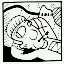

Salut à toi et bienvenue sur mon site. Je suis un artiste belge atteint du trouble schyzo-affectif. Après un long chemin je suis aujourd'hui stabilisé. Tu trouveras ici le fruit de mes recherches plastiques, artistiques et scientifiques.  Je tente par ma pratique d'explorer les contrées cachées au fond de mon moi. Cette démarche, nécessaire à mon l'équilibre, me projete souvent ... en Terra Incognita ! (contact via Soundcloud)
